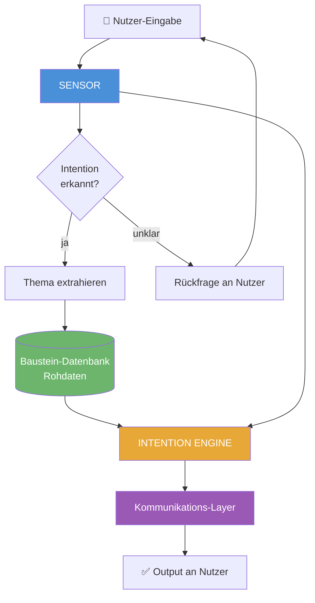
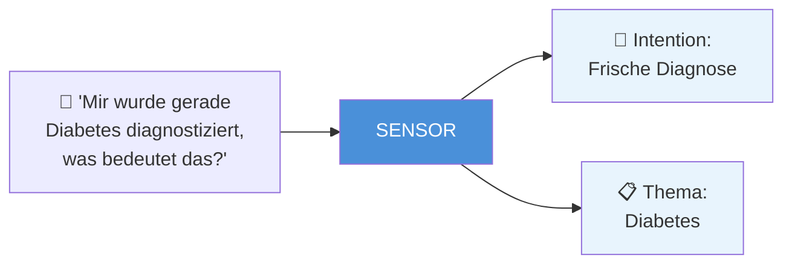
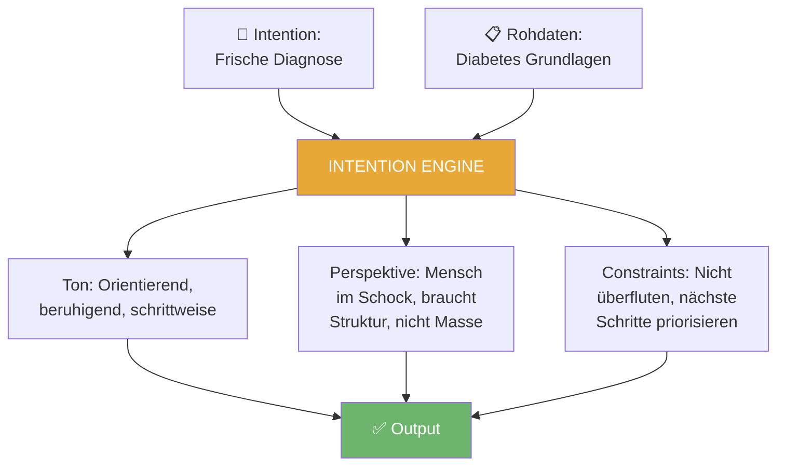
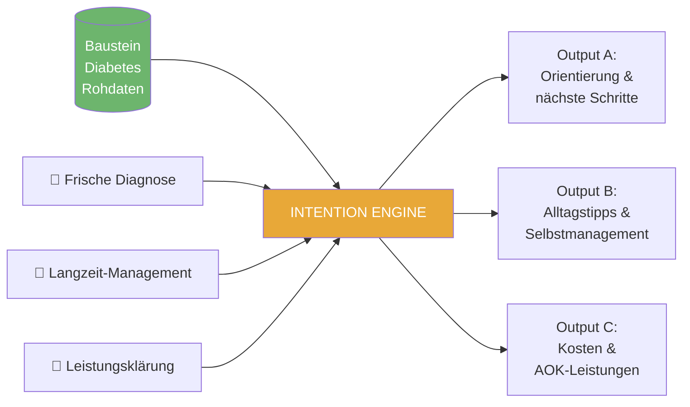
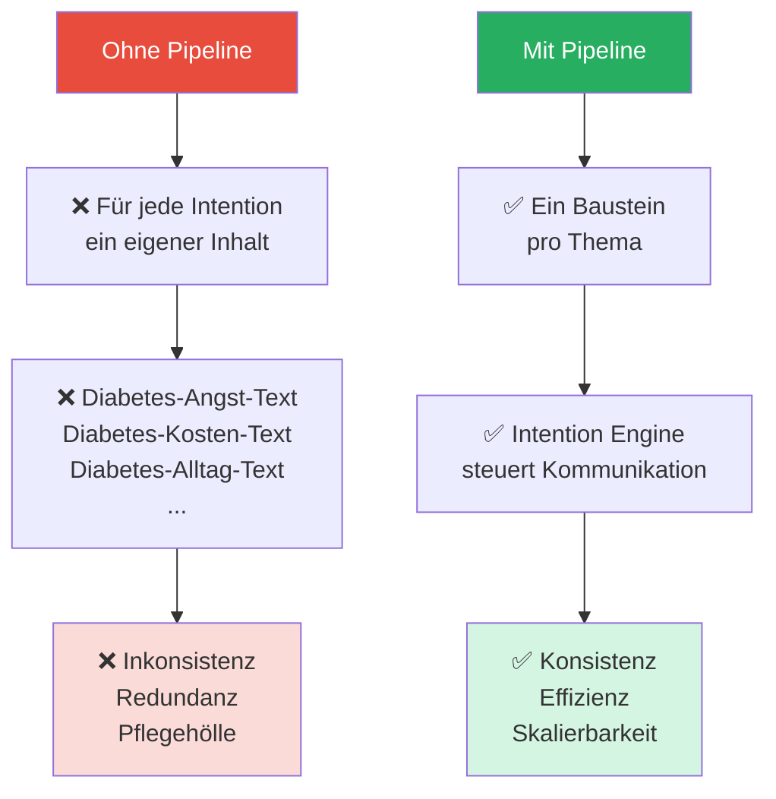
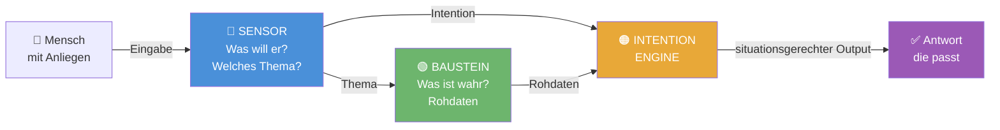

# SAVA Context Pipeline — Stakeholder-Leitfaden

## Architektur & Prinzipien des Intention-gesteuerten Kommunikationssystems

---

## 1. Das Grundprinzip

Die SAVA Context Pipeline löst ein fundamentales Problem in der Gesundheitskommunikation:

> **Dasselbe Thema muss für verschiedene Menschen in verschiedenen Situationen völlig unterschiedlich klingen — ohne dass Inhalte doppelt gepflegt werden müssen.**

Ein Mensch, der gerade die Diagnose Diabetes erhalten hat, braucht eine andere Antwort als jemand, der seit Jahren mit Diabetes lebt — auch wenn die zugrundeliegenden Fachinformationen identisch sind.

Die Pipeline trennt deshalb konsequent drei Dinge:

| Schicht | Frage | Verantwortung |
|---|---|---|
| **Inhalt** | Was ist wahr? | Baustein |
| **Kontext** | Was will der Mensch gerade? | Sensor + Intention Engine |
| **Kommunikation** | Wie muss es klingen? | Intention Engine |

---

## 2. Der Gesamtflow



---

## 3. Die drei Kernkomponenten

### 3.1 🔵 Der Sensor — „Was will der Mensch gerade?"

Der Sensor ist der Einstiegspunkt der Pipeline. Er analysiert die Nutzer-Eingabe und erkennt zwei Dinge gleichzeitig:

- **Die Intention** — den emotionalen und situativen Kontext
- **Das Thema** — den inhaltlichen Gegenstand der Anfrage



Der Sensor kennt **7 Kernintentionen**, die den emotionalen Zustand und das Kommunikationsbedürfnis des Nutzers beschreiben:

| # | Intention | Leitfrage | Emotionaler Zustand |
|---|---|---|---|
| 1 | **Akute Sorge** | „Bin ich krank?" | Angst, Dringlichkeit |
| 2 | **Frische Diagnose** | „Was bedeutet das für mich?" | Schock, Orientierungslosigkeit |
| 3 | **Behandlungssuche** | „Wer kann mir helfen?" | Pragmatisch, lösungsorientiert |
| 4 | **Leistungsklärung** | „Zahlt die AOK das?" | Unsicherheit, Gerechtigkeitsempfinden |
| 5 | **Langzeit-Management** | „Wie lebe ich damit?" | Akzeptanz, Optimierungswunsch |
| 6 | **Angehörigen-Sorge** | „Wie helfe ich meinem Angehörigen?" | Überforderung, Pflichtgefühl |
| 7 | **Präventive Vorsorge** | „Wie bleibe ich gesund?" | Proaktiv, motiviert |

---

### 3.2 🟢 Der Baustein — „Was ist wahr?"

Der Baustein ist **reiner Inhalt**. Er enthält ausschließlich fachlich geprüfte Rohdaten zu einem Thema — ohne Tonalität, ohne Empathie, ohne Intentionslogik.

**Ein Baustein weiß nicht, wer ihn liest. Er weiß nur, was wahr ist.**

```yaml
---
id: baustein-diabetes-grundlagen
title: "Diabetes mellitus Typ 2 — Grundlagen"
thema: diabetes
typ: erkrankung
---

## Inhalt

- Chronische Stoffwechselerkrankung: Blutzucker dauerhaft erhöht
- Ursache: Insulinresistenz der Körperzellen
- Diagnose: HbA1c-Wert > 6,5% oder Nüchternblutzucker > 126 mg/dl
- Behandlung: Ernährung, Bewegung, ggf. Medikamente (Metformin)
- Folgeerkrankungen: Niere, Augen, Nerven, Herz-Kreislauf
- Anlaufstellen: Hausarzt, Diabetologe, AOK-Diabetesprogramm (DMP)
- AOK-Leistungen: DMP Diabetes, Ernährungsberatung, Blutzuckermessgeräte
```

> **Prinzip:** Ein Thema — ein Baustein — einmal gepflegt. Die Qualität der Information liegt hier. Die Kommunikation liegt woanders.

---

### 3.3 🟠 Die Intention Engine — „Wie muss es klingen?"

Die Intention Engine ist das Herzstück der Pipeline. Sie bekommt zwei Inputs:

1. Die **erkannte Intention** vom Sensor
2. Die **Rohdaten** aus dem Baustein

Und übersetzt beides in einen menschlichen, situationsgerechten Output.



---

## 4. Dasselbe Thema — drei verschiedene Outputs

Hier wird das Prinzip greifbar. Derselbe Baustein, drei verschiedene Intentionen, drei völlig verschiedene Antworten:

### Thema: Diabetes | Baustein: identisch



---

**Intention: Frische Diagnose** 😟
> *„Eine neue Diagnose kann sich überwältigend anfühlen — das ist völlig normal. Der wichtigste erste Schritt: ein ausführliches Gespräch mit deinem Hausarzt, der dir die nächsten Schritte erklärt. Die AOK bietet außerdem das Diabetes-Programm DMP an, das dich langfristig begleitet. Möchtest du wissen, wie du dich dort anmelden kannst?"*

---

**Intention: Langzeit-Management** 💪
> *„Mit den richtigen Routinen lässt sich Diabetes gut in den Alltag integrieren. Neben regelmäßiger Bewegung und angepasster Ernährung unterstützt dich das AOK-DMP-Programm mit strukturierten Checks. Viele Betroffene finden auch den Austausch in Selbsthilfegruppen hilfreich — kennst du die Angebote in deiner Region?"*

---

**Intention: Leistungsklärung** 🧾
> *„Die AOK übernimmt im Rahmen des Disease-Management-Programms (DMP) Diabetes eine Reihe von Leistungen: regelmäßige Vorsorgeuntersuchungen, Ernährungsberatung und bei Bedarf auch Blutzuckermessgeräte. Für deinen konkreten Leistungsanspruch wende dich am besten direkt an deine AOK-Geschäftsstelle."*

---

## 5. Warum diese Architektur?



| Vorteil | Bedeutung |
|---|---|
| **Einmal pflegen** | Fachinhalt wird zentral aktualisiert — alle Intentionen profitieren sofort |
| **Konsistenz** | Dieselbe Information, immer korrekt — nur die Sprache variiert |
| **Skalierbarkeit** | Neue Intentionen erfordern keinen neuen Content, nur neue Engine-Regeln |
| **Qualitätssicherung** | Fachliche Prüfung und kommunikative Prüfung sind klar getrennt |

---

## 6. Zusammenfassung auf einen Blick



> **Der Baustein liefert die Wahrheit.**
> **Der Sensor liefert den Kontext.**
> **Die Intention Engine macht daraus Kommunikation.**

---

*Dieser Leitfaden beschreibt die konzeptionelle Architektur der SAVA Context Pipeline. Technische Implementierungsdetails sind separat dokumentiert.*